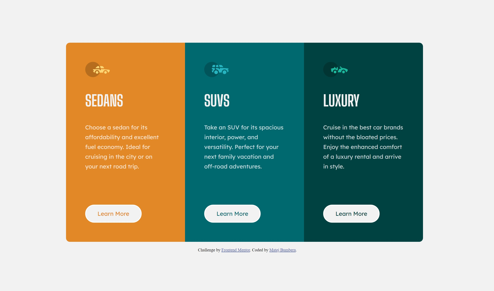

# Frontend Mentor - 3-column preview card component solution

This is a solution to the [3-column preview card component challenge on Frontend Mentor](https://www.frontendmentor.io/challenges/3column-preview-card-component-pH92eAR2-). Frontend Mentor challenges help you improve your coding skills by building realistic projects. 

## Table of contents

- [Overview](#overview)
  - [The challenge](#the-challenge)
  - [Screenshot](#screenshot)
  - [Links](#links)
- [My process](#my-process)
  - [Built with](#built-with)
  - [What I learned](#what-i-learned)
  - [Useful resources](#useful-resources)
- [Author](#author)

## Overview

### The challenge

Users should be able to:

- View the optimal layout depending on their device's screen size
- See hover states for interactive elements

### Screenshot

### Links

- Solution URL: [3-column-preview-card-component solution](https://www.frontendmentor.io/solutions/3columnpreviewcardcomponent-using-flexbox-and-semantic-html-EXlVJXL0iv)
- Live Site URL: [3-column-preview-card-component](https://matejbumbera.github.io/3-column-preview-card-component/)

## My process

### Built with

- Semantic HTML5 markup
- Flexbox

### What I learned

My major learnings were 
 - media query
 - overflow property

I used media query for the site to be responsive. It's useful when we want to change property depending on screensize \(in my case border-radius\)

I needed to use overflow property because after my content got wrapped, it got cut because it didn't fit on a website.

### Useful resources

- [W3Schools](https://www.w3schools.com/) - This website helped me out whenever I got stuck.

## Author

- Frontend Mentor - [@MatejBumbera](https://www.frontendmentor.io/profile/MatejBumbera)
